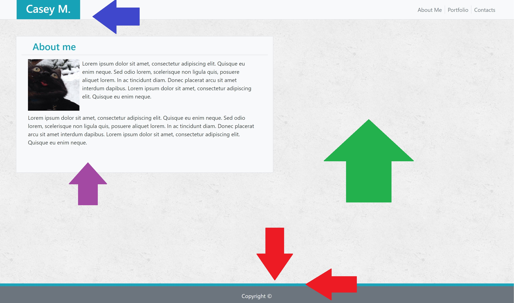
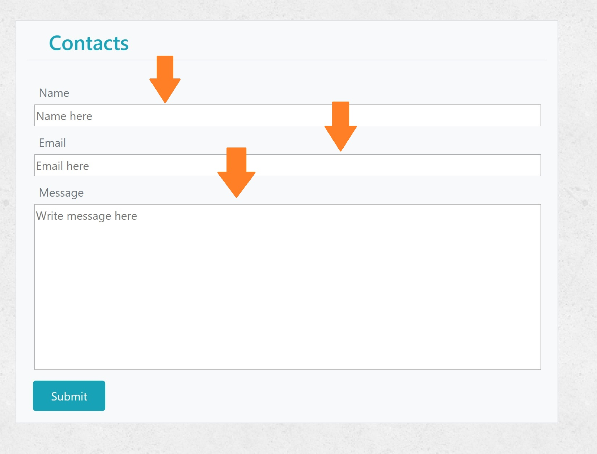
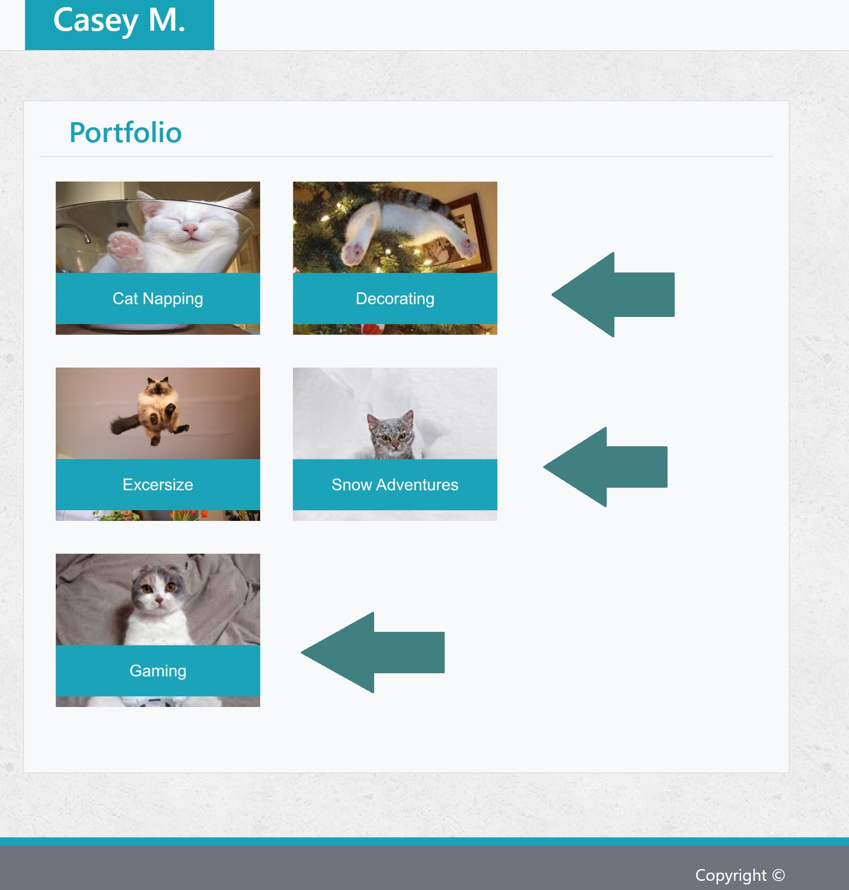

# responsive-portfolio

## Getting Started

I first decided to tackle the Navbar with the intention to make my way down each page. Also, the Navbar would be mostly consistent throught each page so it was important to the structure that i finish it sooner rather than later.

    My greatest struggle here had to be the positioning of the different links and elements within it. i found that i could only place elements either on the far left or far right sides.

        I thought to correct the positioning of the Navbar elements a couple of odd ways starting with placing a container within the bar to represent the 'Your Name' section which is viewed in the example images to be off center (to the left). However, i quickly found that the container could only be moved by so much along the bar using pl, pr, ml, mr, etc... They could only be increased by 5 max (for reasons i am still unsure of). To correct this i then thought to place an empty container (hidden) infront of the 'Your Name' container but this provided further complications with the window's size manipulation. Eventually I decided to move 'Your Name' container as much as i could and match the 'About Me' container to line up with it.

* 

In the image above, i've pointed out the sections of the page that gave me the most trouble.
    
    - The Red arrows point to the border of the Footer which i found could only be altered through CSS (more detail given below).

    - The Blue arrow points to the "your Name" container within the Header/Navbar as i had to constantly make adjustments with every other change made on the page (along with changes made to other pages as the Navbar needed to appear consistent throughout).

    - The Green arrow points to the Background image as a whole. This occupied far too much of my time trying to figure out despite having a very easy CSS solution (more detail given below).

    - The Purple arrow points to the center Container of the page which contains containers within it. This was less of a challenge and more of a time consuming practice, one that i actually enjoyed as it gave me a strong understanding of how Bootstrap works with HTML (more detail given below).

The 'About Me' container section was somewhat difficult to work through as it took a lot of trial and error to figure out how to insert containers with containers to manipulate the text around the image while also maintaining the overall structure of the page. After messing around with these concepts for quite a while, i mannaged to figure out a useful method for manipulating the positioning of the containers. This same method would definitely come in handly later when i began working on the other mages (which i visited here and there when i got stuck to implement methods i was confident could work to the end result).

It's worth noting that i was constantly changing things and making small adjustments while also forgetting to git push my changes to record my steps. this is a habbit i definitely need to improve for my next project.

I then worked on the Footer which was also meant to be consistent on every page similar to the Navbar. This proved particularly challeneging as the border could not be manipulated using Bootsrap alone. I also encountered this issue with the background image which could not be placed without a  section.

    This actually brings me to my greatest challenge in the project. Likely about 80% of the many hours spent on the project were mostly dedicated to trying to use Bootsrap for methods only achievable in CSS. I used Google Fu a countless number of times and even consulted other programmers and classmates but learned that some parts of the project had to be done in CSS (a concept that may have been intentionally left out of the project's description in GitLab as we were expected to recreate the profile using Bootstrap and, to my knowlegde, Bootstrap only).

        Ultimately this frustrating challenege was to my benefit was i learned to better navigate and self-educate utilizing outside sources. This is a very helpful skill to programmers of any field.

After most of the first page was complete, i moved onto the others, dedicating more focus on slight modivications to the center containers that differed from the 'About Me' page (index.html).

* 

    The Contact.html page proved to be a challenge, one i ultimately faced relying primarily on CSS styling within the page.

        The CSS was mostly used to alter the size of each text box to fit the container. However, as i quickly learned, Bootstrap conflicted/overwrote any shared CSS writen code. As such, i found myself altering every aspect of each text box using CSS only. Even the slightest bit of Bootstrap would completely nullify the CSS. The boxes are referenced in the image above with Orange arrows.

* 

    The portfolio page was actually less of a challenge as i had grown comfortable with manipulating images within containers within larger containers. Ironically, in the first portfolio progect (basic-portfolio), this page was the greatest challenge of the project.
        
        I will admit that i took a slight shortcut with the text over the images as i wanted to avoid using CSS as much as possible in the event that it could be damaging to my overall grade of the project. For this reason, and with a little inspiration from outside sources (such as Amazon), i altered the images themselves, adding the text boxes/containers in with a program similar to paint.
        The images are referenced in the image above with Teal arrows.

I continued to mess around with each page, making small alterations to the padding, margins, columns and coloring. One challenge encountered here was with the coloring specifically. Bootstrap does not have the same color scheme given as a requirement in the previous project (basic-porfolio). To compensate for this, i chose the closest color (named in bootstrap as "info"), used a browser tool (Eye Dropper) and copied the color code so that it could be applied to elements on each page that were using CSS. Though this may affect my overall grade, it seemed the most effective method to correct the un-balanced color scheme of each page. This also required me to redo the text boxes/containers as the previous images were set to the older portfolio project's color.

## Built With

* [HTML](https://developer.mozilla.org/en-US/docs/Web/HTML)
* [CSS](https://developer.mozilla.org/en-US/docs/Web/CSS)
* [Bootstrap](https://getbootstrap.com/)

## Deployed Link

* [See Live Site]()

## Authors

*Casey Moldavon

- [Link to Portfolio Site]()
- [Link to Github](https://github.com/casey-moldavon)
- [Link to LinkedIn](https://www.linkedin.com/in/casey-moldavon-442a1761/)

## License

This project is licensed under the MIT License 

